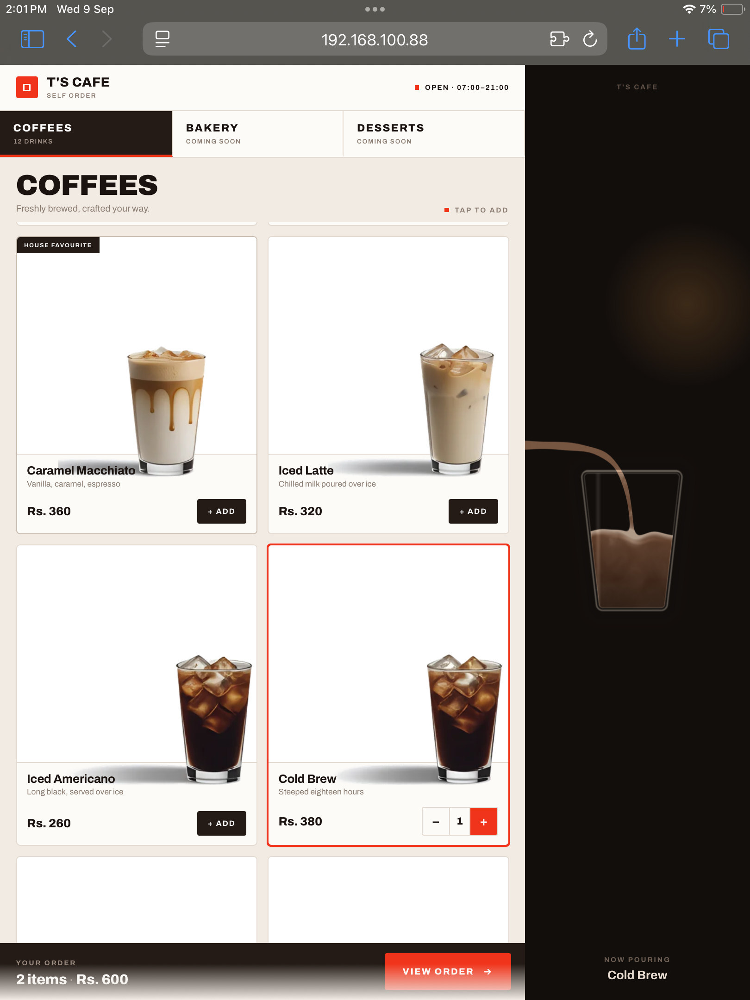
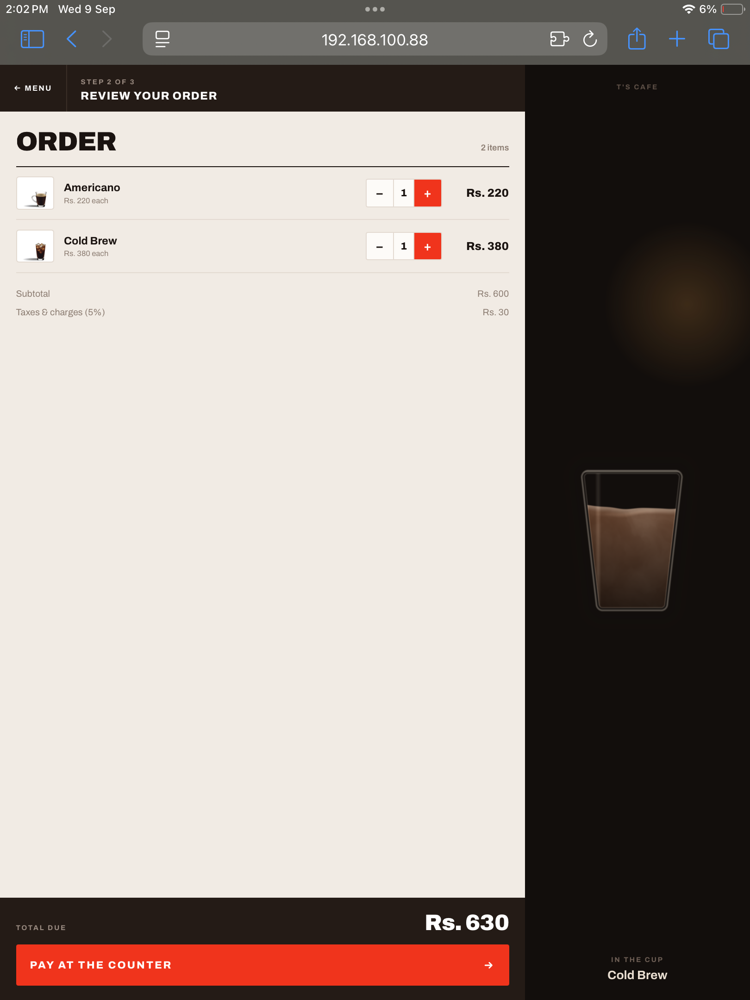
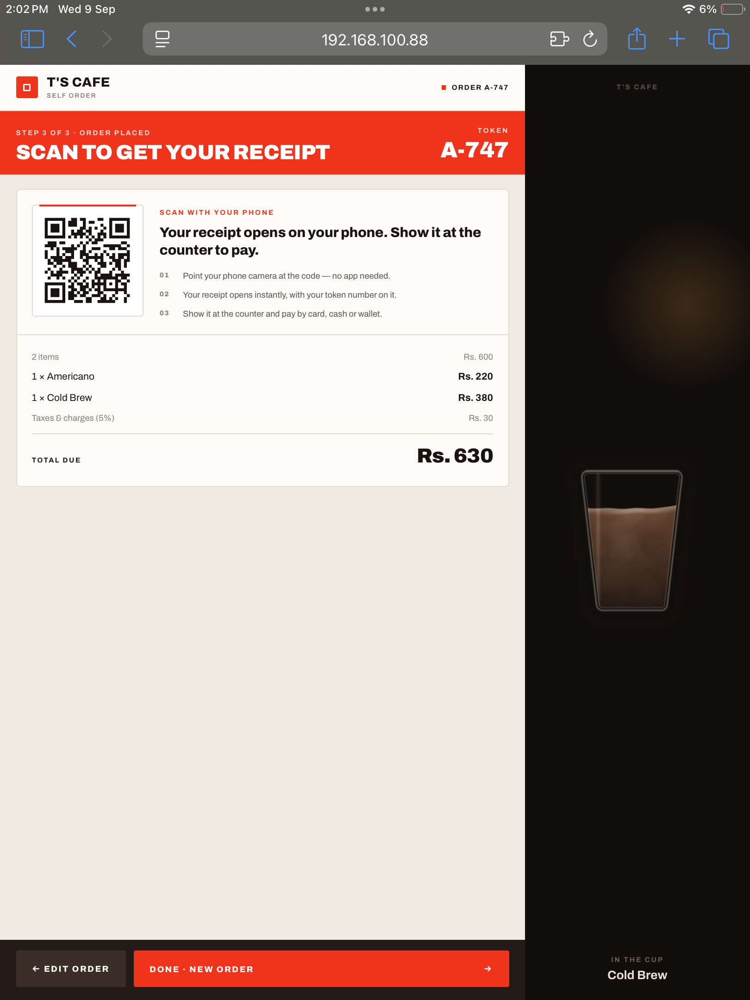

# Café Self-Order Kiosk — Case Study

A touchscreen self-ordering kiosk I designed aimed at café clients, with a real-time fluid animation as the centerpiece of the ordering experience.

*Source code is private (client work). This repo documents the build — screenshots, a demo video, and the technical approach. Happy to walk through the implementation directly in an interview.*

## The idea

Most self-order kiosks are a static menu grid with an "Add" button. I wanted ordering to feel tactile — so instead of a cart icon, drinks physically pour into an on-screen cup as you order, mixing and rising in real time.

## Screens
### Menu

### Home

### Checkout

## How the pour works

The liquid isn't a video clip — every pour is generated live by a GLSL fragment shader, so it responds instantly to any order sequence rather than replaying a fixed animation:

- a rising fill level with a physically-inspired wavy surface that keeps moving after the pour ends
- the falling stream is a continuous swept tube along a curve, not a sprite
- fbm noise handles the milk/coffee mixing and a "plume" effect where fresh liquid visibly sinks into the cup
- the vessel itself swaps — mug for hot drinks, tall glass for cold — matched automatically per drink

## Stack

HTML / CSS / vanilla JS, raw WebGL2 and GLSL for the animation layer. No frameworks, no build step, no external dependencies — the entire interface is one portable file.

